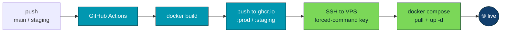

<div align="center">

# 🛫 VATSSA Homepage

### The public homepage for **VATSIM Sub-Saharan Africa**

[](https://vatssa.com)
[](https://github.com/VATSIM-SSA/ssa-homepage/actions/workflows/deploy.yml)


*Division info · live ATC/traffic map · staff directory · virtual airlines · policies · events*

</div>

---

Built with [Next.js](https://nextjs.org) (App Router) by the VATSSA Tech Team and deployed continuously to a self-hosted OVHcloud VPS behind Cloudflare.

## 📑 Table of contents

- [🧱 Stack](#-stack)
- [🌿 Environments & branches](#-environments--branches)
- [💻 Local development](#-local-development)
- [⚙️ Environment variables](#️-environment-variables)
- [🗂️ Data sources](#️-data-sources)
- [🚀 CI/CD pipeline](#-cicd-pipeline)
- [🏗️ Infrastructure](#️-infrastructure)
- [🤝 Contributing](#-contributing)
- [📁 Project structure](#-project-structure)

---

## 🧱 Stack

| Layer | Choice |
|-------|--------|
| **Framework** | Next.js 16 (App Router, SSR) · React 19 |
| **Language** | TypeScript 5 |
| **Styling** | Tailwind CSS 4 |
| **Animation** | Framer Motion |
| **Map** | Leaflet + CartoDB basemap tiles |
| **Icons** | lucide-react |
| **Runtime** | Node.js 20 (`node:20-alpine` in Docker) |
| **Registry** | GitHub Container Registry (`ghcr.io`) |
| **Host** | OVHcloud VPS · Docker · Caddy · Cloudflare Tunnel |

---

## 🌿 Environments & branches

Two long-lived branches, each mapped to a deployed environment. **There is no manual deploy — pushing to a branch ships it.**

| Branch | Environment | URL | Image tag |
|:------:|:-----------:|-----|-----------|
| 🟢 `main` | **production** | https://vatssa.com | `ghcr.io/vatsim-ssa/ssa-homepage:prod` |
| 🟡 `staging` | **staging** | https://homepage-staging.vatssa.com | `ghcr.io/vatsim-ssa/ssa-homepage:staging` |

> [!IMPORTANT]
> `main` is **protected** — no direct pushes; changes land only via a reviewed pull request (see [Contributing](#-contributing)). `staging` is open to the Tech Team for iteration.

---

## 💻 Local development

```bash
npm install
npm run dev      # ▶ http://localhost:3000
```

| Script | Does |
|--------|------|
| `npm run dev` | Dev server with hot reload |
| `npm run build` | Production build |
| `npm run start` | Serve the production build |
| `npm run lint` | ESLint |

> [!TIP]
> Create a `.env.local` for local runs (see below). It's git-ignored and never baked into images.

---

## ⚙️ Environment variables

Set per environment via the `.env` file on the VPS — **never committed** (excluded by `.dockerignore`).

| Variable | Purpose |
|----------|---------|
| `APP_ENV` | `production` / `staging` — environment label |
| `APP_URL` | Public base URL for this environment |
| `STAFF_API` | Staff directory JSON source |
| `RVAS_API` | Recognised virtual airlines JSON source |
| `SSC_API` | Screenshot-competition JSON source |
| `USERS_API` | Roster / online controllers source |
| `EVENTS_API` | Events source |
| `POLICIES_API` | Policy documents source |
| `MINUTES_API` | Meeting minutes source (`files.vatssa.com/homepage-data/minutes.json`) |
| `BOOKINGS_API` | Bookings source |

> [!NOTE]
> The `*_API` values point at the MinIO CDN (`files.vatssa.com/homepage-data/*.json`) for the data the site owns, and at VATSIM/internal APIs for live roster/events. See [Data sources](#️-data-sources).

---

## 🗂️ Data sources

Content that VATSSA maintains (staff list, RVAs, screenshot winners, roster/events placeholders) lives as JSON objects in the MinIO `homepage-data` bucket and is fetched **server-side** by the Next.js API routes — the browser never calls the CDN directly. Board members with the right MinIO role can update individual files (e.g. `stafflist.json`, `rva.json`) **without a redeploy**; the site reflects the change on next request.

---

## 🚀 CI/CD pipeline

Defined in [`.github/workflows/deploy.yml`](.github/workflows/deploy.yml). Every push to `main` or `staging` (docs-only commits are skipped) runs:



1. **Build & push** — builds the image, pushes it to `ghcr.io/vatsim-ssa/ssa-homepage` tagged with the target (`prod`/`staging`) and the commit SHA. Layer cache lives in the Actions cache for fast rebuilds.
2. **Deploy** — connects to the VPS over SSH with a **command-restricted key** scoped to the branch's GitHub *Environment*. The key can only invoke the deploy script for its own environment, which runs `docker compose pull && docker compose up -d` in the matching directory.
3. **Notify** — on failure, posts an embed to a Discord webhook with the branch, commit, and a link to the run.

> [!WARNING]
> **Security model.** Deploy secrets (`VPS_SSH_KEY`, host/port/user) are **Environment secrets**, so a `staging`-branch workflow can't read the production key and vice-versa. Each SSH key is welded to one environment by an OpenSSH *forced command* — even if leaked, it can only trigger a redeploy of its own environment, never open a shell or reach the other. Actions minutes are free (public repo).

---

## 🏗️ Infrastructure

- **Registry** — images published to `ghcr.io/vatsim-ssa/ssa-homepage` (public package).
- **Host** — OVHcloud VPS running Docker. Each environment is a Compose project under `/srv/apps/homepage/{prod,staging}` that pulls its image tag.
- **Edge** — Cloudflare Tunnel → Caddy reverse proxy → the container on port `3000`. No inbound ports are open on the VPS except SSH.
- **CSP** — a strict Content-Security-Policy is served in production (see [`next.config.ts`](next.config.ts)); `img-src` is widened only for the CartoDB map tiles.

---

## 🤝 Contributing

`main` is protected. To ship a change:

1. 🌿 Branch from `staging` (or push to `staging` directly if you're on the Tech Team).
2. 🧪 Push to `staging` — it **auto-deploys** to the staging site for review.
3. 🔀 When ready for production, open a **pull request into `main`**. It requires review from a **code owner** (see [`.github/CODEOWNERS`](.github/CODEOWNERS)) before it can merge.
4. ✅ On merge, the **production deploy runs automatically**.

Keep PRs focused, describe what changed and why, and test on staging before requesting a production merge.

---

## 📁 Project structure

```
app/                            Next.js App Router routes + API routes
components/                     React components (incl. the live map)
hooks/                          React hooks
lib/ · util/                    Shared helpers
public/                         Static assets
Dockerfile                      Production image build
.github/workflows/deploy.yml    CI/CD pipeline
next.config.ts                  Next config + Content-Security-Policy
```

---

<div align="center">

**© VATSIM Sub-Saharan Africa** · Maintained by the VATSSA Tech Team

<sub>The African skies are open, no matter what.</sub>

</div>
